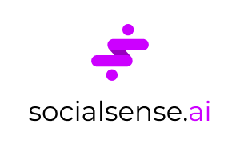

  

### Use machine learning to find the perfect image and hashtags to reach a broader audience.

*[Winner of "Best Hack Using Machine Learning" at LAHacks 2020.](https://devpost.com/software/socialsense-ai)*

**Built in 36 hours.**

## Inspiration

Hashtags are powerful. When used correctly on a platform like Instagram, they can be tools for companies and creators alike to reach an engaged audience. That being said, we are all too familiar with misused hashtags; however, what often goes unnoticed is the artist or educator who could have put their content in front of the right people post after post, if only they were able to use this confusing and often unpredictable tool to its fullest potential.

## What It Does

Using Socialsense, you’ll be able to find the perfect image and hashtags to reach the right people. First, input your Instagram handle, select the images you consider posting, and submit. Socialsense will predict which images will attract the most attention. The user can then choose an image to post, and socialsense will find the most optimal hashtags to use, in addition to estimating how much engagement the post will receive with these hashtags.

## Demo

  

[YouTube Link](https://www.youtube.com/watch?v=zVT3j0gtMA4)

## Credits
- [Intrinsic Image Popularity Assessment](https://github.com/dingkeyan93/Intrinsic-Image-Popularity#intrinsic-image-popularity-assessment) by Keyan Ding, Kede Ma, and Shiqi Wang from the City University of Hong Kong.

  - popularity_model/model/model-resnet50.pth was taken from here.

